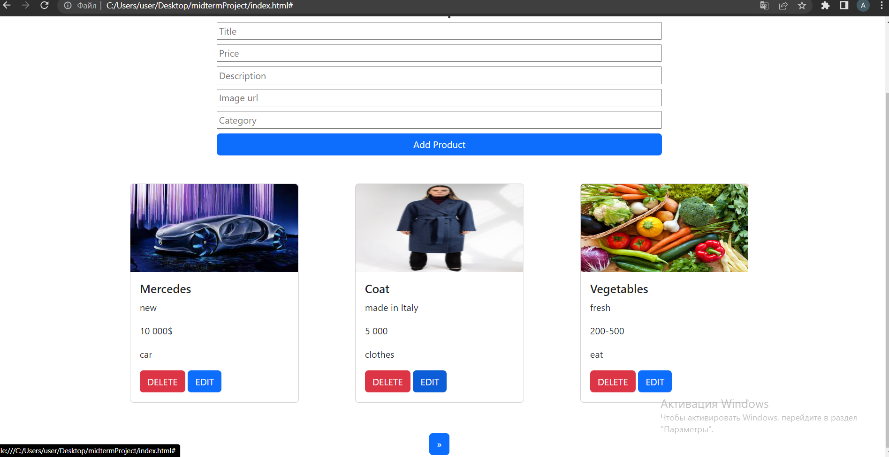

#Internet Store

Classic CRUD, which have functions like:
*C-Create
*R-Read
*U-Update
*D-Delete

---

Run db.json on 7000th port in a terminal.

Any user can access this website. Register and be sure to log in after that.

If the user has entered his page, his nickname will be fixed in the NAVBAR, he will also have access to the admin panel for adding a product for sale with the functions to update/delete it

Products will be sorted into categories. Working filtering is available through search, pagination, and a limit of 3 products on 1 page (all through fetch api)

All user and product data is automatically stored in db.json.

---

Responsiveness

---

PageSpeed
